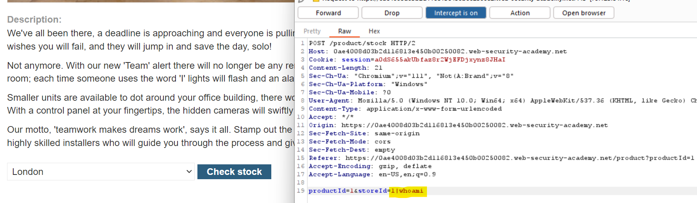
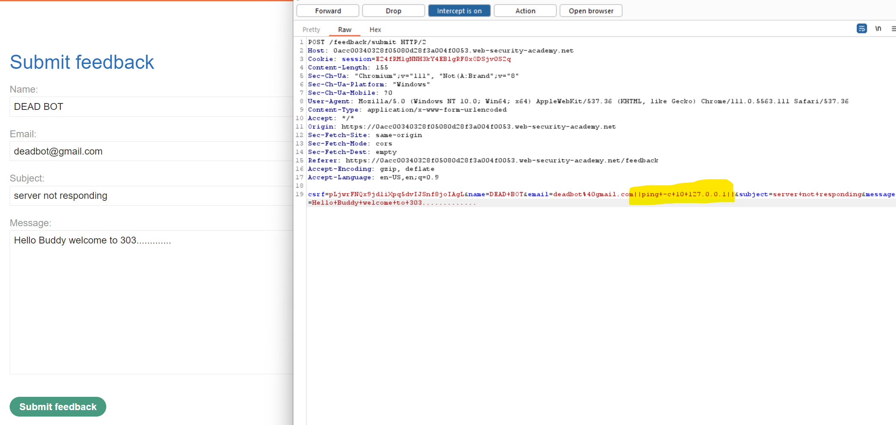
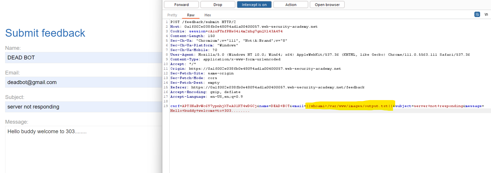
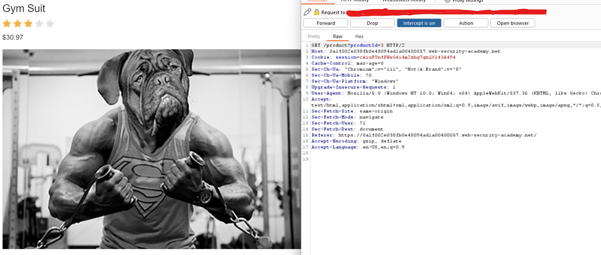
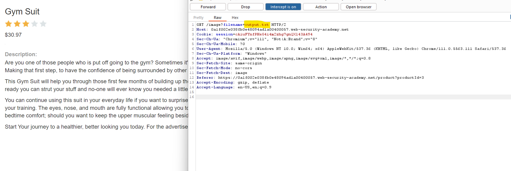

# Burpsuite Lab Answers
## OS command injection 
### 1) OS command injection, simple case
#### Solution: 

--------------------------------

### 2) Blind OS command injection with time delays
#### Solution: 

--------------------------------

### 3) Blind OS command injection with output redirection
#### Solution: 

--------------------------------
